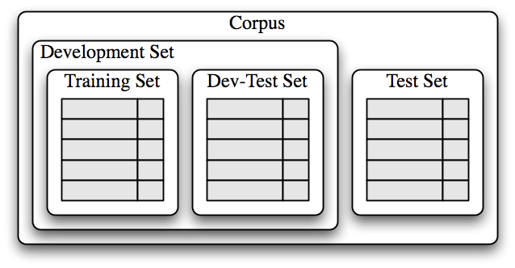

# Text Classification

Classification is the task of choosing the 'correct' label for an input. Supervised classification refers to a labeling task where the **labels** are **defined in advance** (this is in contrast to unsupervised classification, e.g. topic modeling, where the labels are not predefined). Some examples of supervised classification include:

* Categorizing an email as spam or not spam
* Categorizing the topic of a news article is from a fixed list of topics
* Categorizing the sentiment of a document as positive, negative, or neutral

**Supervised classification** tasks uses data that has *already* been classified in order to train machine learning algorithms to assign labels to unclassified data. The central idea here is that we are training our computer to look for certain word features of text to develop a model of language labels. This model can then be used to classify new bodies of text.

Below, we will explore different supervised classification methods. 

### Gender classification

Names ending in a, e and i are likely to be female, while names ending in k, o, r, s and t are likely to be male. Let's build a classifier to model these differences more precisely.

The first step in creating a classifier is deciding what features of the input are relevant, and how to encode those features. For this example, we'll start by just looking at the final letter of a given name. The following feature extractor function builds a dictionary containing relevant information about a given name.


```python
def gender_features(word):
    return {'last_letter': word[-1]}

gender_features('Louis')
```


    {'last_letter': 's'}


The output of our gender_features function is a dictionary of feature sets, which maps feature names (last_letter) to their values (word[-1]). Feature names typically provide a human-readable description of the feature, as in the example 'last_letter'. Feature values are typically simple values, such as booleans, numbers, or strings. In this case, it is a simple string.

Now that we've defined a gender feature extractor, we need to prepare a list of examples and corresponding class labels.


```python
import nltk
from nltk.corpus import names
labeled_names = ([(name, 'male') for name in names.words('male.txt')] + [(name, 'female') for name in names.words('female.txt')])

import random
random.shuffle(labeled_names)

labeled_names[:10] #list first 10 names
```


    [('Weider', 'male'),
     ('Dalia', 'female'),
     ('Shaun', 'male'),
     ('Page', 'female'),
     ('Casey', 'male'),
     ('Mara', 'female'),
     ('Maryangelyn', 'female'),
     ('Cindy', 'female'),
     ('Jeniece', 'female'),
     ('Annelise', 'female')]


We have just created a list of word features with gender labels (stored in the object **labeled_names**). 

What does our features set look like?


```python
featuresets = [(gender_features(n), gender) for (n, gender) in labeled_names]
featuresets[:10] 
```


    [({'last_letter': 'r'}, 'male'),
     ({'last_letter': 'a'}, 'female'),
     ({'last_letter': 'n'}, 'male'),
     ({'last_letter': 'e'}, 'female'),
     ({'last_letter': 'y'}, 'male'),
     ({'last_letter': 'a'}, 'female'),
     ({'last_letter': 'n'}, 'female'),
     ({'last_letter': 'y'}, 'female'),
     ({'last_letter': 'e'}, 'female'),
     ({'last_letter': 'e'}, 'female')]


Let's now divide this features list into two sets: a **training set** and a **test set**. The training set will be used to train a computer algorithm classifier. The test set will be used to evaluate how well our classifier performs.


```python
train_set, test_set = featuresets[500:], featuresets[:500]
classifier = nltk.NaiveBayesClassifier.train(train_set)
```

Let's test how our classifier works on names that didn't appear in the training or test set


```python
classifier.classify(gender_features('Gandalf')), classifier.classify(gender_features('Bilbo'))
```


    ('male', 'male')


These character names from *The Hobbit* are correctly classified. But our classifier isn't perfect.


```python
classifier.classify(gender_features('Katniss')), classifier.classify(gender_features('Dumbledore')) 
```


    ('male', 'female')


A classifier will never be 100% accurate. But we can systematically evaluate how well a classifier performs by looking at how well it classifies data that has already been labeled.

Below, let's look at how our classifier assigns gender labels to data in our test set. Discrepancies between the gender label assigned by our classifier and the gender labels that were already included in the test set provides a measure of classifier accuracy.


```python
print(nltk.classify.accuracy(classifier, test_set))
```

    0.712


Our gender classifier is approximately 75% accurate, which is pretty good.

We can further examine the classifier to determine which features it found most effective for distinguishing gender.


```python
classifier.show_most_informative_features(5)
```

    Most Informative Features
                 last_letter = 'a'            female : male   =     39.6 : 1.0
                 last_letter = 'k'              male : female =     32.4 : 1.0
                 last_letter = 'f'              male : female =     15.3 : 1.0
                 last_letter = 'p'              male : female =     12.6 : 1.0
                 last_letter = 'm'              male : female =     11.9 : 1.0


This list shows the likelihood ratios between different word features and their labeled categories. For example, names in the training set that end in "a" are about 36 times more likely to be female than male, but names that end in "k" are 32 times more likely to be male than female.

# Choosing The Right Features

Selecting relevant features and deciding how to encode them for a classifier can have an enormous impact on the classifier's ability to extract a good model. Much of the interesting work in building a classifier is deciding what features might be relevant and how best to represent them. Although it's often possible to get decent performance by using a fairly simple and obvious set of features, there are usually significant gains to be had by using carefully constructed features based on an understanding of the task at hand.

Typically, feature extractors are built through a process of trial-and-error. It's common to start with a "kitchen sink" approach and then checking to see which features actually are helpful.


```python
def gender_features2(name):
    features = {}
    features["first_letter"] = name[0].lower()
    features["last_letter"] = name[-1].lower()
    for letter in 'abcdefghijklmnopqrstuvwxyz':
        features["count({})".format(letter)] = name.lower().count(letter)
        features["has({})".format(letter)] = (letter in name.lower())
    return features

gender_features2('Tommy') 
```


    {'first_letter': 't',
     'last_letter': 'y',
     'count(a)': 0,
     'has(a)': False,
     'count(b)': 0,
     'has(b)': False,
     'count(c)': 0,
     'has(c)': False,
     'count(d)': 0,
     'has(d)': False,
     'count(e)': 0,
     'has(e)': False,
     'count(f)': 0,
     'has(f)': False,
     'count(g)': 0,
     'has(g)': False,
     'count(h)': 0,
     'has(h)': False,
     'count(i)': 0,
     'has(i)': False,
     'count(j)': 0,
     'has(j)': False,
     'count(k)': 0,
     'has(k)': False,
     'count(l)': 0,
     'has(l)': False,
     'count(m)': 2,
     'has(m)': True,
     'count(n)': 0,
     'has(n)': False,
     'count(o)': 1,
     'has(o)': True,
     'count(p)': 0,
     'has(p)': False,
     'count(q)': 0,
     'has(q)': False,
     'count(r)': 0,
     'has(r)': False,
     'count(s)': 0,
     'has(s)': False,
     'count(t)': 1,
     'has(t)': True,
     'count(u)': 0,
     'has(u)': False,
     'count(v)': 0,
     'has(v)': False,
     'count(w)': 0,
     'has(w)': False,
     'count(x)': 0,
     'has(x)': False,
     'count(y)': 1,
     'has(y)': True,
     'count(z)': 0,
     'has(z)': False}


However, there are limits to the number of features that you should use. Too many features can make the algorithm rely on idiosyncrasies in your training data that don't generalize well to new examples. This problem is known as ***overfitting***, and can be especially problematic when working with small training sets. 

How does gender_features2 compare against our original gender_features classifier?


```python
featuresets = [(gender_features2(n), gender) for (n, gender) in labeled_names]
train_set, test_set = featuresets[500:], featuresets[:500]
classifier = nltk.NaiveBayesClassifier.train(train_set)
print(nltk.classify.accuracy(classifier, test_set))
```

    0.762


### Error analysis

Once an initial set of features has been chosen, we can refine the feature set using **error analysis**. 

First, we select a development set, containing the corpus data for creating the model. This development set is then subdivided into the training set and the dev-test set.


```python
train_names = labeled_names[1500:]
devtest_names = labeled_names[500:1500]
test_names = labeled_names[:500]
```

The training set is used to train the model and the dev-test set is used to perform error analysis. Note: it is important that we employ a separate dev-test set for error analysis rather than just using the test set. The division of the corpus data into different subsets is shown below.



We train a model using the training set [1], and then run it on the dev-test set [2]:


```python
train_set = [(gender_features2(n), gender) for (n, gender) in train_names]
devtest_set = [(gender_features2(n), gender) for (n, gender) in devtest_names]
test_set = [(gender_features2(n), gender) for (n, gender) in test_names]
classifier = nltk.NaiveBayesClassifier.train(train_set) #[1]
print(nltk.classify.accuracy(classifier, devtest_set)) #[2]
```

    0.739


Using the dev-test set, we can generate a list of errors that the classifier makes when predicting name genders:


```python
errors = []
for (name, tag) in devtest_names:
    guess = classifier.classify(gender_features2(name))
    if guess != tag:
        errors.append( (tag, guess, name) )
```

We can then examine individual error cases where the model predicted the wrong label and try to determine what additional pieces of information would allow the classifier to make the right decision (or which existing pieces of information are tricking it into making the wrong decision). The feature set can then be adjusted accordingly.


```python
len(errors) # number of mislabeled names
```


    261


```python
for (tag, guess, name) in sorted(errors):
    print('correct={:<8} guess={:<8s} name={:<30}'.format(tag, guess, name))
```

    correct=female   guess=male     name=Agnes                         
    correct=female   guess=male     name=Ardis                         
    correct=female   guess=male     name=Ardys                         
    correct=female   guess=male     name=Audy                          
    correct=female   guess=male     name=Berte                         
    correct=female   guess=male     name=Beth                          
    correct=female   guess=male     name=Bo                            
    correct=female   guess=male     name=Bobbette                      
    correct=female   guess=male     name=Bonny                         
    correct=female   guess=male     name=Brear                         
    correct=female   guess=male     name=Brit                          
    correct=female   guess=male     name=Buffy                         
    correct=female   guess=male     name=Cam                           
    correct=female   guess=male     name=Cameo                         
    correct=female   guess=male     name=Carroll                       
    correct=female   guess=male     name=Cherish                       
    correct=female   guess=male     name=Chloris                       
    correct=female   guess=male     name=Coriss                        
    correct=female   guess=male     name=Correy                        
    correct=female   guess=male     name=Cris                          
    correct=female   guess=male     name=Cristin                       
    correct=female   guess=male     name=Dagmar                        
    correct=female   guess=male     name=Deborah                       
    correct=female   guess=male     name=Doreen                        
    correct=female   guess=male     name=Dorthy                        
    correct=female   guess=male     name=Drew                          
    correct=female   guess=male     name=Dulce                         
    correct=female   guess=male     name=Easter                        
    correct=female   guess=male     name=Elsbeth                       
    correct=female   guess=male     name=Em                            
    correct=female   guess=male     name=Evy                           
    correct=female   guess=male     name=Fallon                        
    correct=female   guess=male     name=Faythe                        
    correct=female   guess=male     name=Florence                      
    correct=female   guess=male     name=Francesmary                   
    correct=female   guess=male     name=Gladys                        
    correct=female   guess=male     name=Goldy                         
    correct=female   guess=male     name=Gussie                        
    correct=female   guess=male     name=Gwenore                       
    correct=female   guess=male     name=Gwyneth                       
    correct=female   guess=male     name=Harriott                      
    correct=female   guess=male     name=Honor                         
    correct=female   guess=male     name=Inez                          
    correct=female   guess=male     name=Ingeborg                      
    correct=female   guess=male     name=Ivett                         
    correct=female   guess=male     name=Jerry                         
    correct=female   guess=male     name=Jo                            
    correct=female   guess=male     name=Joby                          
    correct=female   guess=male     name=Joell                         
    correct=female   guess=male     name=Joey                          
    correct=female   guess=male     name=Josee                         
    correct=female   guess=male     name=Joselyn                       
    correct=female   guess=male     name=Jourdan                       
    correct=female   guess=male     name=Karon                         
    correct=female   guess=male     name=Kit                           
    correct=female   guess=male     name=Korry                         
    correct=female   guess=male     name=Kristin                       
    correct=female   guess=male     name=Lucky                         
    correct=female   guess=male     name=Margaret                      
    correct=female   guess=male     name=Marget                        
    correct=female   guess=male     name=Margo                         
    correct=female   guess=male     name=Marjory                       
    correct=female   guess=male     name=Marylou                       
    correct=female   guess=male     name=Meridith                      
    correct=female   guess=male     name=Merry                         
    correct=female   guess=male     name=Mignon                        
    correct=female   guess=male     name=Moll                          
    correct=female   guess=male     name=Mommy                         
    correct=female   guess=male     name=Myriam                        
    correct=female   guess=male     name=Olympe                        
    correct=female   guess=male     name=Patty                         
    correct=female   guess=male     name=Perl                          
    correct=female   guess=male     name=Perry                         
    correct=female   guess=male     name=Phoebe                        
    correct=female   guess=male     name=Phylis                        
    correct=female   guess=male     name=Phyllis                       
    correct=female   guess=male     name=Pru                           
    correct=female   guess=male     name=Prudence                      
    correct=female   guess=male     name=Rebekah                       
    correct=female   guess=male     name=Rey                           
    correct=female   guess=male     name=Robyn                         
    correct=female   guess=male     name=Rosaleen                      
    correct=female   guess=male     name=Rosalyn                       
    correct=female   guess=male     name=Rosamond                      
    correct=female   guess=male     name=Roselyn                       
    correct=female   guess=male     name=Roxane                        
    correct=female   guess=male     name=Roxie                         
    correct=female   guess=male     name=Roxine                        
    correct=female   guess=male     name=Rubi                          
    correct=female   guess=male     name=Scarlet                       
    correct=female   guess=male     name=Shanon                        
    correct=female   guess=male     name=Sharyl                        
    correct=female   guess=male     name=Sherry                        
    correct=female   guess=male     name=Sheryl                        
    correct=female   guess=male     name=Shir                          
    correct=female   guess=male     name=Sigrid                        
    correct=female   guess=male     name=Siobhan                       
    correct=female   guess=male     name=Sonny                         
    correct=female   guess=male     name=Starr                         
    correct=female   guess=male     name=Stormi                        
    correct=female   guess=male     name=Sue                           
    correct=female   guess=male     name=Terese                        
    correct=female   guess=male     name=Terry                         
    correct=female   guess=male     name=Theo                          
    correct=female   guess=male     name=Thomasine                     
    correct=female   guess=male     name=Tiffy                         
    correct=female   guess=male     name=Timmy                         
    correct=female   guess=male     name=Tish                          
    correct=female   guess=male     name=Torie                         
    correct=female   guess=male     name=Torrie                        
    correct=female   guess=male     name=Trix                          
    correct=female   guess=male     name=Trixi                         
    correct=female   guess=male     name=Trudey                        
    correct=female   guess=male     name=Tuesday                       
    correct=female   guess=male     name=Ulrike                        
    correct=female   guess=male     name=Venus                         
    correct=female   guess=male     name=Wandis                        
    correct=female   guess=male     name=Wendy                         
    correct=female   guess=male     name=Willi                         
    correct=female   guess=male     name=Willy                         
    correct=female   guess=male     name=Wrennie                       
    correct=female   guess=male     name=Yoko                          
    correct=female   guess=male     name=Zorah                         
    correct=male     guess=female   name=Abby                          
    correct=male     guess=female   name=Aditya                        
    correct=male     guess=female   name=Agamemnon                     
    correct=male     guess=female   name=Alain                         
    correct=male     guess=female   name=Aleks                         
    correct=male     guess=female   name=Allan                         
    correct=male     guess=female   name=Allie                         
    correct=male     guess=female   name=Allin                         
    correct=male     guess=female   name=Andrea                        
    correct=male     guess=female   name=Andri                         
    correct=male     guess=female   name=Anthony                       
    correct=male     guess=female   name=Antone                        
    correct=male     guess=female   name=Antonin                       
    correct=male     guess=female   name=Antony                        
    correct=male     guess=female   name=Archie                        
    correct=male     guess=female   name=Arie                          
    correct=male     guess=female   name=Aristotle                     
    correct=male     guess=female   name=Arne                          
    correct=male     guess=female   name=Arvie                         
    correct=male     guess=female   name=Arvy                          
    correct=male     guess=female   name=Barnaby                       
    correct=male     guess=female   name=Barny                         
    correct=male     guess=female   name=Benjamin                      
    correct=male     guess=female   name=Benn                          
    correct=male     guess=female   name=Benny                         
    correct=male     guess=female   name=Binky                         
    correct=male     guess=female   name=Blair                         
    correct=male     guess=female   name=Bradly                        
    correct=male     guess=female   name=Brinkley                      
    correct=male     guess=female   name=Cal                           
    correct=male     guess=female   name=Chaddie                       
    correct=male     guess=female   name=Chancey                       
    correct=male     guess=female   name=Charlie                       
    correct=male     guess=female   name=Chaunce                       
    correct=male     guess=female   name=Chrissy                       
    correct=male     guess=female   name=Clair                         
    correct=male     guess=female   name=Clancy                        
    correct=male     guess=female   name=Clare                         
    correct=male     guess=female   name=Clemente                      
    correct=male     guess=female   name=Clinton                       
    correct=male     guess=female   name=Constantin                    
    correct=male     guess=female   name=Cyril                         
    correct=male     guess=female   name=Dani                          
    correct=male     guess=female   name=Dannie                        
    correct=male     guess=female   name=Darby                         
    correct=male     guess=female   name=Darian                        
    correct=male     guess=female   name=Darrin                        
    correct=male     guess=female   name=Daryl                         
    correct=male     guess=female   name=Dean                          
    correct=male     guess=female   name=Deryl                         
    correct=male     guess=female   name=Dickie                        
    correct=male     guess=female   name=Emil                          
    correct=male     guess=female   name=Evelyn                        
    correct=male     guess=female   name=Ezechiel                      
    correct=male     guess=female   name=Flynn                         
    correct=male     guess=female   name=Gail                          
    correct=male     guess=female   name=Galen                         
    correct=male     guess=female   name=Garey                         
    correct=male     guess=female   name=Gene                          
    correct=male     guess=female   name=Gil                           
    correct=male     guess=female   name=Glynn                         
    correct=male     guess=female   name=Granville                     
    correct=male     guess=female   name=Hadleigh                      
    correct=male     guess=female   name=Hamel                         
    correct=male     guess=female   name=Hamlen                        
    correct=male     guess=female   name=Hanan                         
    correct=male     guess=female   name=Hassan                        
    correct=male     guess=female   name=Hillel                        
    correct=male     guess=female   name=Hymie                         
    correct=male     guess=female   name=Ike                           
    correct=male     guess=female   name=Izzy                          
    correct=male     guess=female   name=Jeremie                       
    correct=male     guess=female   name=Jimmie                        
    correct=male     guess=female   name=Jimmy                         
    correct=male     guess=female   name=Joaquin                       
    correct=male     guess=female   name=Jonathan                      
    correct=male     guess=female   name=Jule                          
    correct=male     guess=female   name=Kalvin                        
    correct=male     guess=female   name=Keene                         
    correct=male     guess=female   name=Kendall                       
    correct=male     guess=female   name=Kennedy                       
    correct=male     guess=female   name=Kin                           
    correct=male     guess=female   name=Lane                          
    correct=male     guess=female   name=Laurance                      
    correct=male     guess=female   name=Lay                           
    correct=male     guess=female   name=Lennie                        
    correct=male     guess=female   name=Lenny                         
    correct=male     guess=female   name=Leslie                        
    correct=male     guess=female   name=Lindy                         
    correct=male     guess=female   name=Linoel                        
    correct=male     guess=female   name=Lonnie                        
    correct=male     guess=female   name=Lovell                        
    correct=male     guess=female   name=Luke                          
    correct=male     guess=female   name=Lyn                           
    correct=male     guess=female   name=Manuel                        
    correct=male     guess=female   name=Marion                        
    correct=male     guess=female   name=Marlin                        
    correct=male     guess=female   name=Marlon                        
    correct=male     guess=female   name=Martainn                      
    correct=male     guess=female   name=Marten                        
    correct=male     guess=female   name=Meryl                         
    correct=male     guess=female   name=Mika                          
    correct=male     guess=female   name=Millicent                     
    correct=male     guess=female   name=Milt                          
    correct=male     guess=female   name=Neal                          
    correct=male     guess=female   name=Nealon                        
    correct=male     guess=female   name=Nealy                         
    correct=male     guess=female   name=Neddie                        
    correct=male     guess=female   name=Nevil                         
    correct=male     guess=female   name=Neville                       
    correct=male     guess=female   name=Nilson                        
    correct=male     guess=female   name=Noble                         
    correct=male     guess=female   name=Obadiah                       
    correct=male     guess=female   name=Odie                          
    correct=male     guess=female   name=Pascale                       
    correct=male     guess=female   name=Pierce                        
    correct=male     guess=female   name=Rafael                        
    correct=male     guess=female   name=Raleigh                       
    correct=male     guess=female   name=Randall                       
    correct=male     guess=female   name=Randell                       
    correct=male     guess=female   name=Ray                           
    correct=male     guess=female   name=Reggie                        
    correct=male     guess=female   name=Rickey                        
    correct=male     guess=female   name=Salman                        
    correct=male     guess=female   name=Sansone                       
    correct=male     guess=female   name=Simone                        
    correct=male     guess=female   name=Slade                         
    correct=male     guess=female   name=Sonnie                        
    correct=male     guess=female   name=Stillman                      
    correct=male     guess=female   name=Sullivan                      
    correct=male     guess=female   name=Tait                          
    correct=male     guess=female   name=Timmie                        
    correct=male     guess=female   name=Virge                         
    correct=male     guess=female   name=Yale                          
    correct=male     guess=female   name=Yardley                       
    correct=male     guess=female   name=Zachariah                     
    correct=male     guess=female   name=Zacharie                      
    correct=male     guess=female   name=Zechariah                     


Looking through this list of errors, it appears that certain 2-character suffixes are indicative of gender. For example, names ending in 'yn' appear to be predominantly female, despite the fact that names ending in 'n' tend to be male; and names ending in 'ch' are usually male, even though names that end in 'h' tend to be female. 

Let's adjust our feature extractor to include features for two-letter suffixes:


```python
def gender_features(word):
    return {'suffix1': word[-1:], 'suffix2': word[-2:]}
```

Let's rebuild our classifier with the new feature extractor and see whether its accuracy improves.


```python
train_set = [(gender_features(n), gender) for (n, gender) in train_names]
devtest_set = [(gender_features(n), gender) for (n, gender) in devtest_names]
classifier = nltk.NaiveBayesClassifier.train(train_set)
print(nltk.classify.accuracy(classifier, devtest_set))
```

    0.776


This error analysis procedure can be repeated after checking for patterns in errors made by the improved classifier. *Each time the error analysis procedure is repeated, we should select a different dev-test/training split, to ensure that the classifier does not start to reflect idiosyncrasies in the dev-test set*.

However, once we've used the dev-test set to develop the model, we can no longer trust that it will give us an accurate idea of how well the model would perform on new data. *It is therefore important to keep the test set separate, and unused, until our model development is complete*. At that point, we can use the test set to evaluate how well our model will perform on new input values.

### Exercise

In addition to the suffix features, add another word feature to your gender classifier and evaluate the accuracy of this new model.

# Document Classification

Sometimes we want to classify an entire document rather than a particular word. Document classification is especially useful for sentiment analysis because the emotions or opinions contained in a text are not typically represented by a single word. 

Sentiment analysis is a category of supervised classification algorithms where the labels consist of different emotions, often negative, positive, and neutral. The procedure is the same as before: using pre-labeled corpora, we can build classifiers that automatically tag new documents with appropriate category labels.

As an illustrative example, let's work with the Movie Reviews Corpus that categorizes each review as positive or negative.


```python
from nltk.corpus import movie_reviews
documents = [(list(movie_reviews.words(fileid)), category)
             for category in movie_reviews.categories()
             for fileid in movie_reviews.fileids(category)]

random.shuffle(documents)
```

Now let's define a feature extractor for our documents such that the classifier will know which aspects of the data it should pay attention to.

For document topic identification, we can define a feature for each word that indicates whether the document contains that word. To limit the number of features that the classifier needs to process, we begin by constructing a list of the 2000 most frequent words in the overall corpus. We can then define a feature extractor that simply checks whether each of these words is present in a given document.


```python
all_words = nltk.FreqDist(w.lower() for w in movie_reviews.words())
word_features = list(all_words)[:2000]

def document_features(document):
    document_words = set(document)
    features = {}
    for word in word_features:
        features['contains({})'.format(word)] = (word in document_words)
    return features
```

Now that we've defined our feature extractor we can use it to train a classifier to label new movie reviews. To check how reliable the resulting classifier is, we compute its accuracy on the test set. And once again, we can use show_most_informative_features() to find out which features the classifier found to be most informative.


```python
featuresets = [(document_features(d), c) for (d,c) in documents]
train_set, test_set = featuresets[100:], featuresets[:100]
classifier = nltk.NaiveBayesClassifier.train(train_set)
```


```python
print(nltk.classify.accuracy(classifier, test_set))
```

    0.82


```python
classifier.show_most_informative_features(10)
```

    Most Informative Features
     contains(unimaginative) = True              neg : pos    =      8.2 : 1.0
        contains(schumacher) = True              neg : pos    =      6.9 : 1.0
              contains(mena) = True              neg : pos    =      6.9 : 1.0
            contains(suvari) = True              neg : pos    =      6.9 : 1.0
         contains(atrocious) = True              neg : pos    =      6.5 : 1.0
            contains(shoddy) = True              neg : pos    =      6.3 : 1.0
            contains(turkey) = True              neg : pos    =      5.8 : 1.0
            contains(justin) = True              neg : pos    =      5.7 : 1.0
               contains(ugh) = True              neg : pos    =      5.7 : 1.0
           contains(unravel) = True              pos : neg    =      5.7 : 1.0


# Example using Naive Bayes Classification

Let's run some classification tasks using the Supreme Court confirmation hearings transcripts, found here: [https://www.rstreet.org/2019/04/04/supreme-court-confirmation-hearing-transcripts-as-data/](http://)

This data contains the text of every Supreme Court confirmation hearing for which Senate Judiciary Committee  transcripts are available (beginning in 1971 with hearings for Lewis Powell and William Rehnquist and concluding with Neil Gorsuch’s 2017 hearing). 


```python
import pandas as pd
import nltk

data = pd.read_csv('../input/Oct-7-2019-Supreme-Court-Confirmation-Hearing-Transcript.csv', encoding='latin1')

data = data.reset_index()

data.head()
```


<div>
<style scoped>
    .dataframe tbody tr th:only-of-type {
        vertical-align: middle;
    }

    .dataframe tbody tr th {
        vertical-align: top;
    }

    .dataframe thead th {
        text-align: right;
    }
</style>
<table border="1" class="dataframe">
  <thead>
    <tr style="text-align: right;">
      <th></th>
      <th>index</th>
      <th>Total Order</th>
      <th>Order</th>
      <th>Year</th>
      <th>Hearing</th>
      <th>Title</th>
      <th>Speaker (Party)(or nominated by)</th>
      <th>Speaker and title</th>
      <th>Statements</th>
      <th>sentiment</th>
    </tr>
  </thead>
  <tbody>
    <tr>
      <td>0</td>
      <td>0</td>
      <td>1</td>
      <td>1</td>
      <td>2017</td>
      <td>Neil M. Gorsuch</td>
      <td>Chairman</td>
      <td>R</td>
      <td>Senator Chuck Grassley (IA)</td>
      <td>Chairman Grassley. Good morning, everybody. I ...</td>
      <td>positive</td>
    </tr>
    <tr>
      <td>1</td>
      <td>1</td>
      <td>2</td>
      <td>2</td>
      <td>2017</td>
      <td>Neil M. Gorsuch</td>
      <td>Nominee</td>
      <td>R</td>
      <td>Neil M. Gorsuch</td>
      <td>Judge Gorsuch. Pleasure to be here. Thank you.</td>
      <td>positive</td>
    </tr>
    <tr>
      <td>2</td>
      <td>2</td>
      <td>3</td>
      <td>3</td>
      <td>2017</td>
      <td>Neil M. Gorsuch</td>
      <td>Chairman</td>
      <td>R</td>
      <td>Senator Chuck Grassley (IA)</td>
      <td>Chairman Grassley. This is a big day for you a...</td>
      <td>positive</td>
    </tr>
    <tr>
      <td>3</td>
      <td>3</td>
      <td>4</td>
      <td>4</td>
      <td>2017</td>
      <td>Neil M. Gorsuch</td>
      <td>Nominee</td>
      <td>R</td>
      <td>Neil M. Gorsuch</td>
      <td>Judge Gorsuch. Just a little, Senator.</td>
      <td>neutral</td>
    </tr>
    <tr>
      <td>4</td>
      <td>4</td>
      <td>5</td>
      <td>5</td>
      <td>2017</td>
      <td>Neil M. Gorsuch</td>
      <td>Chairman</td>
      <td>R</td>
      <td>Senator Chuck Grassley (IA)</td>
      <td>Chairman Grassley. Yes. Before we begin, I wou...</td>
      <td>neutral</td>
    </tr>
  </tbody>
</table>
</div>


### Classifying partisanship

Do Republicans and Democrats speak differently at judicial confirmation hearings? That is, can we infer party label based on what a speaker says? 

The dataset already includes the party label of each speaker. We can use this information to create a partisanship classifier.

The first thing we need to do to create our classifier is to create a set of word features associated with a given party label. There are a few pre-processing steps we will need to do in order to extract the labeled text features from our pandas dataframe object so it can be added to our classifier.

### Pre-processing steps

The first thing we want to do is create a list of all words across all documents. Recall that this information is used to calculate the posterior probabilities in naive bayes classification.

Let's begin by tokenizing all of the documents.


```python
words = data['Statements'].apply(nltk.word_tokenize)
```


```python
words # the tokenized words are structured as a dataframe.
```


    0        [Chairman, Grassley, ., Good, morning, ,, ever...
    1        [Judge, Gorsuch, ., Pleasure, to, be, here, .,...
    2        [Chairman, Grassley, ., This, is, a, big, day,...
    3        [Judge, Gorsuch, ., Just, a, little, ,, Senato...
    4        [Chairman, Grassley, ., Yes, ., Before, we, be...
                                   ...                        
    30173    [Mr., POWELL, ., I, wish, to, thank, the, chai...
    30174    [The, CHAIRMAN, ., Thank, you, ,, sir, ., Now,...
    30175    [Senator, SCOTT, ., IS, that, room, 2300, ,, M...
    30176    [The, CHAIRMAN, ., It, is, the, Judiciary, Com...
    30177    [Senator, SCOTT, ., Room, 2228, ., I, just, sa...
    Name: Statements, Length: 30178, dtype: object


Turn this dataframe into a list object.


```python
words = list(words) # the tokenized words are now structured as a list of lists
```

Create a master list of **all words ** across **all documents**. This list will be used to construct our features set below.


```python
import itertools
all_words = (list(itertools.chain.from_iterable(words))) # we will use this information below when we build our naive bayes classifier.
```

Now let's pre-process the text in the original dataframe, tokenizing words and converting everything to lower case.


```python
data['Statements'] = data['Statements'].apply(lambda x: x.lower())
data['Statements'] = data['Statements'].apply(nltk.word_tokenize)
```

Create a list object that links texts with party label. We will split this data up into a training and test set for our classifier.


```python
documents = list(zip(data['Statements'], data['Speaker (Party)(or nominated by)']))
```

Now let's use this information to create a features extractor for our documents. The following features extractor indicates whether a given document contains a word from our master lists of words (all_words). To limit the number of features that the classifier needs to process, we begin by constructing a list of the 2000 most frequent words in the overall corpus [1]. We then define a feature extractor [2] that simply checks whether each of these words is present in a given document.


```python
all_words = nltk.FreqDist(w.lower() for w in all_words) #[1]
word_features = list(all_words)[:2000]

def document_features(document): #[2]
    document_words = set(document)
    features = {}
    for word in word_features:
        features['contains({})'.format(word)] = (word in document_words)
    return features
```

Now that we've defined our feature extractor, we can use it to train a classifier to label new, previously unseen texts. To check how reliable the resulting classifier is, we compute its accuracy on the test set. And once again, we can use the command show_most_informative_features( ) to find out which features the classifier found to be most informative.


```python
featuresets = [(document_features(d), c) for (d,c) in documents]
train_set, test_set = featuresets[100:], featuresets[:100]
classifier = nltk.NaiveBayesClassifier.train(train_set)
```


```python
classifier.show_most_informative_features(5)
```

    Most Informative Features
           contains(kennedy) = True                D : nan    =     37.5 : 1.0
       contains(innumerable) = True              nan : R      =     26.6 : 1.0
           contains(gorsuch) = True                R : D      =     26.4 : 1.0
         contains(important) = True                R : nan    =     25.6 : 1.0
             contains(judge) = True                R : nan    =     25.5 : 1.0


```python
print(nltk.classify.accuracy(classifier, test_set))
```

    0.35


With approximately 35% accuracy, this is a pretty abysmal classifier. This classifier performs more poorly than if we just flipped a coin to assign party label (i.e. 50% accuracy)!

What could we do to improve our classifier? How about we restrict our sample to a single confirmation hearing, i.e. Neil Gorsuch's hearing in 2017? How well does the classifier perform for this subset?


```python
data = pd.read_csv('../input/Oct-7-2019-Supreme-Court-Confirmation-Hearing-Transcript.csv', encoding='latin1')
data = data.reset_index()


data = data[data['Statements'].notnull() & (data['Year'] == 2017)] # only hearings from 2017
words = data['Statements'].apply(nltk.word_tokenize)
words = list(words)

all_words = (list(itertools.chain.from_iterable(words)))


data['Statements'] = data['Statements'].apply(lambda x: x.lower())
data['Statements'] = data['Statements'].apply(nltk.word_tokenize)


documents = list(zip(data['Statements'], data['Speaker (Party)(or nominated by)']))

all_words = nltk.FreqDist(w.lower() for w in all_words)
word_features = list(all_words)[:2000]

def document_features(document):
    document_words = set(document)
    features = {}
    for word in word_features:
        features['contains({})'.format(word)] = (word in document_words)
    return features

featuresets = [(document_features(d), c) for (d,c) in documents]
train_set, test_set = featuresets[100:], featuresets[:100]
classifier = nltk.NaiveBayesClassifier.train(train_set)

print(nltk.classify.accuracy(classifier, test_set))

```

    0.87


Restricting our classifier to 2017 improved our accuracy by over 50%! Why do you think the classifier does a better job on 2017 than for the corpus as a whole? 

# Exercises

* Using the sentiment labels you constructed for the Supreme Court Confirmation Hearings transcripts, use a Naive Bayes classifier to predict the sentiment of statements made by and before the Senate Judiciary Committee.
* Evaluate the accuracy of your classifier.
* Run error analysis on your classifier. Which features are contributing to misclassification?
* Try improving the accuracy of your classifier by adding or substracting word features or subsetting the data.

